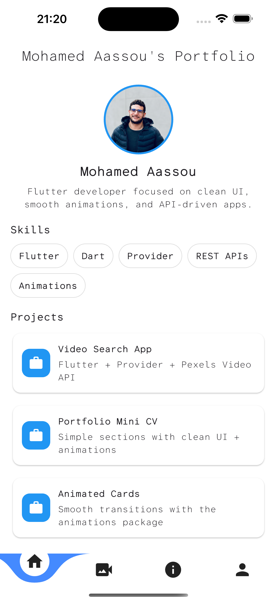
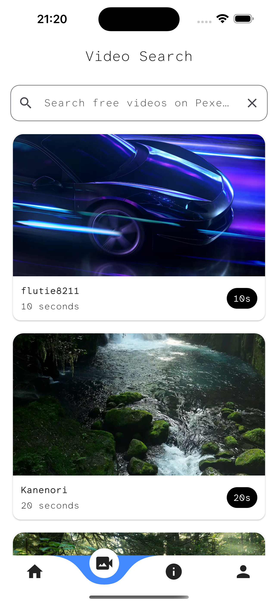
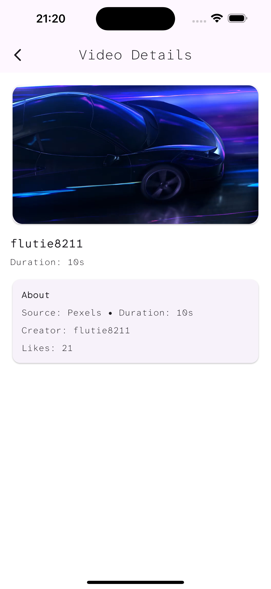
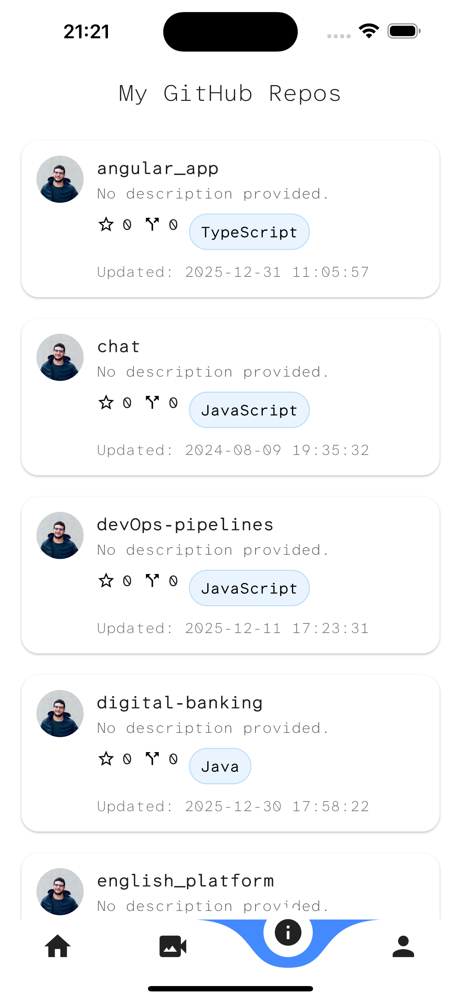
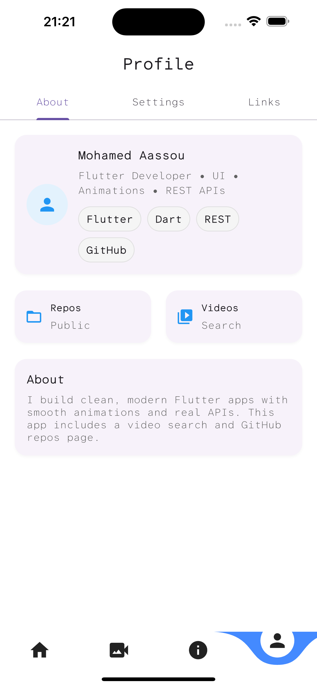

# flutter_project_exam

Mini CV + API-driven Flutter demo app.

Supervisor: **Prof. Ayad**

The app has a bottom navigation with 4 tabs:

- **Home**: portfolio landing page (skills + projects) with small animations.
- **Video Search**: search and watch short videos from the Pixabay Video API.
- **GitHub Repos**: list public repositories for `mohammedaassou`.
- **Profile**: simple tabbed profile page (About / Settings / Links).

## Requirements

- Flutter SDK (Dart SDK is managed by Flutter)
- A device/emulator (Android Studio / Xcode / iOS Simulator)

## Run

From the project root:

1) Install dependencies:

`flutter pub get`

2) Run the app:

`flutter run`

## API configuration

### Pixabay Video API key

The video search uses Pixabay's Video API:

- Base URL: `https://pixabay.com/api/videos`
- Key is currently defined in: `lib/env.dart`

If you want to use your own key, edit `lib/env.dart` and replace `pexelsApiKey`.

Note: some UI text still mentions “Pexels”, but the current implementation calls Pixabay.

### GitHub API

The repos page fetches public repositories from:

`https://api.github.com/users/mohammedaassou/repos`

No key is required for basic public requests.

## Project structure

- `lib/main.dart`: app entry point
- `lib/principale_page.dart`: bottom navigation (CurvedNavigationBar)
- `lib/home_page.dart`: landing / mini CV
- `lib/video_search_page.dart`: search page + list of results
- `lib/video_detail_page.dart`: video playback using `video_player`
- `lib/repos_page.dart`: GitHub repositories list
- `lib/profile_page.dart`: profile tabs
- `lib/services/`: HTTP clients
- `lib/models/`: data models for API responses
- `assets/`: images and fonts

## Screenshots

| Home (Mini CV) | Video Search | Video Details |
|---|---|---|
|  |  |  |

| GitHub Repos | Profile |
|---|---|
|  |  |

## Dependencies

Key packages from `pubspec.yaml`:

- `http`: REST calls
- `video_player`: video playback
- `animations`: Material motion transitions
- `curved_navigation_bar`: bottom nav

## Build a PDF report (LaTeX)

A LaTeX report source is included at `report/rapport.tex`.

To compile locally (requires a LaTeX distribution like MacTeX):

`cd report && pdflatex rapport.tex`

You can run `pdflatex` twice to refresh the table of contents.
